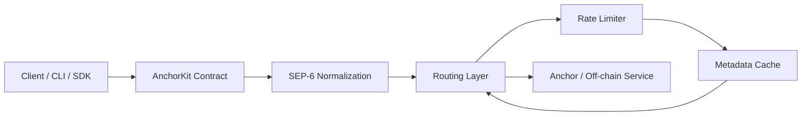

# AnchorKit Architecture

This document explains how the core AnchorKit components interact, including the typical data flow for a deposit operation.

## Component Interaction

AnchorKit is designed as a layered integration stack. A typical deposit request passes through the following components:

- **Client / CLI / SDK**: The user-facing entry point that creates requests.
- **AnchorKit Contract**: The core contract logic and on-chain validation layer.
- **SEP-6 Normalization**: A service layer that adapts anchor deposit/withdrawal responses to a canonical shape.
- **Routing**: Selects the correct anchor endpoint for the requested asset/service.
- **Rate Limiter**: Protects anchor backends by throttling or delaying requests.
- **Metadata Cache**: Stores anchor capabilities, limits, and discovery data for fast reuse.

### Mermaid diagram



### ASCII diagram

```
Client / CLI / SDK
        |
        v
AnchorKit Contract
        |
        v
SEP-6 Normalization
        |
        v
Routing Layer
        |
        v
Rate Limiter
        |
        v
Metadata Cache
        |
        v
Anchor / Off-chain Service
```

## Deposit data flow

1. The client sends a deposit request, including asset, amount, subject, and optional metadata.
2. The AnchorKit contract validates the request and prepares the canonical service call.
3. The SEP-6 normalization layer maps the request and the anchor response into a stable `DepositResponse` shape.
4. The routing layer selects the best anchor endpoint for the requested asset and service.
5. The rate limiter evaluates the request using configured thresholds and may delay or reject traffic.
6. The metadata cache provides cached anchor capabilities, fee limits, and service availability to improve routing decisions.
7. The request is forwarded to the anchor service.
8. The anchor response is normalized, validated, and returned to the client.

## Why this matters

This architecture separates transport logic from business rules and makes AnchorKit easier to extend:

- **Contract** handles state and policy.
- **SEP-6** ensures service responses are normalized.
- **Routing** selects the correct endpoint.
- **Rate limiting** protects backend anchors.
- **Caching** improves performance and avoids repeated discovery.
